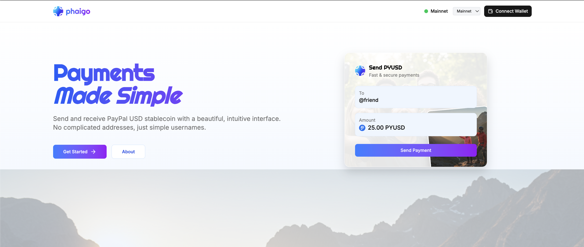
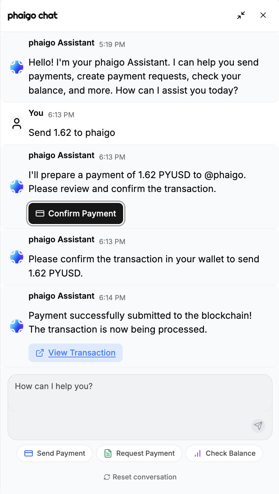

```markdown
# Phaigo - Payments Made Simple

Visit: [App](https://phaigo.vercel.app) (Alpha Version)  
Video: [Youtube](https://youtu.be/9R6En16OFXQ)

Phaigo is an application for PYUSD payments. It allows users to:

- Create personal profiles with custom usernames
- Send PYUSD to any user via their username
- Use an AI assistant to send transactions in a super-simple manner
- Request payments from others
- View transaction history
- Generate payment links to share with others
- Explore PYUSD analytics



## Web3 Hackathon Submission

Phaigo was developed as part of a Web3 hackathon focused on enabling PYUSD transactions and leveraging Google Cloud’s Blockchain RPC service.

Key points:

- **PYUSD Integration:** The core functionality revolves around sending, receiving and managing the PYUSD stable-coin via a user-friendly interface.
- **GCP Blockchain RPC Utilization:** Google Cloud’s Blockchain RPC service is used for all on-chain interactions, providing reliability, scalability and access to advanced methods for analytics.

### Leveraging Computationally Expensive Methods

A key requirement of the hackathon is demonstrating the effective use of GCP’s free, computationally expensive RPC methods. Phaigo utilizes these for its **Deep Dive** analytics features:

- **Methods Used:** `debug_traceTransaction`, `trace_block`
- **Purpose:** Provide detailed, granular execution traces of specific PYUSD transactions and blocks, enabling deeper analysis beyond standard transaction data
- **Implementation:**
  - **Frontend UI:** Users select trace methods and input parameters in the Deep Dive tab ([`src/components/analytics/Analytics.tsx`](src/components/analytics/Analytics.tsx)).
  - **Backend API:** Secure API routes handle the requests and interact with GCP:
    - Transaction tracing: [`src/app/api/blockchain/transaction/trace/route.ts`](src/app/api/blockchain/transaction/trace/route.ts)
    - Block tracing: [`src/app/api/blockchain/block/trace/route.ts`](src/app/api/blockchain/block/trace/route.ts)
  - **Service Logic:** Core RPC call logic resides in [`src/lib/services/blockchain/analytics.ts`](src/lib/services/blockchain/analytics.ts).

_Showcasing the unique advantages of the GCP RPC service._

## Tech Stack

- **Frontend:** Next.js 15.3, React 19, TailwindCSS v4  
- **Backend:** Next.js API Routes, PostgreSQL, Prisma ORM 6.6  
- **Blockchain:** Ethereum (Mainnet & Sepolia), PYUSD ERC-20 token  
- **Authentication:** Wallet-based authentication with Web3Modal  
- **UI Components:** Shadcn UI, TailwindCSS v4, tw-animate-css & tailwindcss-motion for animations  
- **Testing:** Vitest 3.1.1 with @testing-library for unit & component tests  

## Architecture

Phaigo uses an on-chain-synced database as a single source of truth. This means:

1. All blockchain transactions are first recorded in the database with a **PENDING** status.  
2. Once the transaction is confirmed on-chain, the database record is updated to **COMPLETED**.  
3. If the transaction fails, the record is updated to **FAILED**.  

Benefits:

- Immediate user feedback while waiting for confirmations  
- Reliable history regardless of re-orgs  
- Simplified frontend state management  

## Getting Started

### For Development

- Docker (for PostgreSQL)  
- Ethereum wallet (MetaMask, Coinbase Wallet, WalletConnect, etc.)

## Database

- **User:** Stores user profiles with usernames & wallet addresses  
- **Payment:** Records of PYUSD transfers between users  
- **Request:** Payment requests created by users  

## Features

- **User Profiles:** Create a unique username that others can use to send you payments  
- **PYUSD Transfers:** Send PYUSD to any user on the platform using their username—optionally via AI  
  
- **Payment Requests:** Request PYUSD from others with optional notes & expiry  
- **Transaction History:** View your sent and received payments  
- **Payment Links:** Generate shareable payment links  

## Analytics Dashboard

Powered by Google Cloud’s Blockchain RPC service, Phaigo offers deep insights into PYUSD activity:

- **Overview:** High-level stats & metrics  
- **Transactions:** Detailed analysis of volume, frequency & patterns  
- **Deep Dive:** In-depth tracing with `debug_traceTransaction` and `trace_block` (wallet required) – see [`Analytics.tsx`](src/components/analytics/Analytics.tsx), [`transaction/trace/route.ts`](src/app/api/blockchain/transaction/trace/route.ts), [`block/trace/route.ts`](src/app/api/blockchain/block/trace/route.ts)

### WIP

See [`Analytics Components`](src/components/analytics):

- **Network Congestion:** Real-time Ethereum gas & pending tx view  
- **Contract Activity:** Monitor PYUSD contract interactions  
- **Historical Data:** Long-term trends (potential BigQuery integration)

## Roadmap

Future plans include:

- **Mobile App:** Native iOS & Android  
- **Multi-Chain Expansion:** PYUSD on additional chains  
- **Merchant Integration:** Tools for businesses to accept PYUSD  
- **Enhanced Analytics:** Deeper insights & visualizations  

## Test the Live App

Visit: [phaigo live](https://phaigo.vercel.app)  
_Alpha version – expect occasional bugs & rate-limiting._

